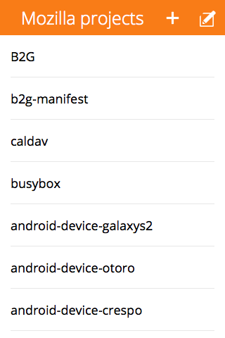
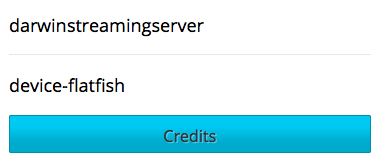

# Building applications for Firefox OS using AngularJS

When you start developing for Firefox OS you might be underwhelmed by the tools that are provided. There is no standard UI toolkit, or a JavaScript framework that all apps build on. This is not a situation that's needed either because in essence Firefox OS is the web; and thus gives you complete freedom in the toolchain you use. This gives us the advantage to use any new technology that pops up also on Firefox OS. In Telenor Digital we took advantage of this and built a ready-to-go application template on top of [AngularJS](http://angularjs.org/), the MVW framework by Google. The template grew from some internal applications that we built for Firefox OS and addresses the following things:

1. A proper framework with Angular to quickly build on top of
2. An integrated build system on top of RequireJS
3. Ability to publish both hosted and packaged apps
4. Offline capabilities using appcache or packages; and content caching in indexedDB
5. Built in set of UI components with the Firefox OS Building Blocks
6. Multiple views, and some built in view transitions

Let's look at how the demo application looks like. It's a standard CRUD app that shows a list-detail pattern: http://janjongboom.com/ffos-list-detail/. You can click on items to go to the detail view, you can edit items, or add new items. The '+' button is an install button (only visible in Firefox) and allows you to add the app to your phone (Android / FxOS).



## Getting the code

To start building, do this:

* `git clone git@github.com:comoyo/ffos-list-detail.git`
* `npm install`
* `./node_modules/bower/bin/bower install`
* Now you can open `www/index.html` in any browser, or use the app manager and add the
    `www` folder as a packaged app.

## Adding a new button

We can build on top of this application. Let's say that we want to add a credits screen
that shows who built the application. First thing we need to do is add a button somewhere.
In our case let's put it on the home screen of the app. The code of the view is in
`www/views/list.html`

The components that you see come from the Firefox OS Building Blocks, which are the same
blocks that are used to build Firefox OS itself. Let's add a new button at the bottom of
the screen (below the `</ul>` and the `</section>`:

```html
<a class="recommend" role="button" ng-tap="go('/credits', 'popup')">Credits</a>
```

Important here is the `ng-tap` attribute. When we tap this item we go to `/credits` URL,
with animate `pop-up`. There are four built in animations: forward, backward, popup, popdown;
but you can create your own (add link to desc).

Now when we look at this it doesn't look like a button yet, because we didn't tell that we
needed the button building block. Go to `css/main.css` and add the following line
to make it look nice:

```css
@import url("../components/building-blocks/style/buttons.css");
```



All this is always documented on the page on the Building Blocks website.

## Hooking it up

When we click on the button nothing happens though (well, we get redirected back
to the list view), and that's because we don't listen on the /credits URL yet.
To fix that we need to create a route handler (like in any MV* server side
framework as well). Open the list of routes in `js/app.js`, and add a handler
for the credits URL (before the `otherwise` handler):

```js
.when('/credits', {
  templateUrl: 'views/credits.html',
  controller: 'CreditsCtrl'
})
```

Here we tell which controller we want to consult (with JS code), and which
view (with HTML) belongs to that. Let's create the view first. Add a new file
called credits.html in the `views` folder.

```html
<section role="region">
  <header>
    <!-- here we handle the back click and we do a popdown animation -->
    <a ng-tap="go('/', 'popdown')"><span class="icon icon-back">back</span></a>
    <h1>Credits</h1>
  </header>
</section>
<!-- The content of the view should have a 'view' class, and add the name of
     the view to easily style the view later -->
<section class="view credits">
  This application is made by {{ name }}. <!-- AngularJS does data binding for us -->
</section>
```

To style this view we can add some content in `css/app.css`, f.e. add some
padding and make the text bigger:

```css
.view.credits {
  padding: 1.5rem;
  font-size: 2rem;
}
```

Now write a simple controller to fill the content of `{{ name }}`, using standard
AngularJS data binding. Add a new file called `credits.js` in `www/js/controllers`:

```js
/* We use RequireJS AMD style modules to get a reference to the app object */
define(['app'], function(app) {
  /* Tell that we're defining a controller with name
    CreditsCtrl, and with dependencies on $scope, we specify this as string
    to not break when minifying
  */
  app.controller('CreditsCtrl', ['$scope',
    /* Implementation. AngularJS does dependency injection to fill the $scope var */
    function CreditsCtrl($scope) {
      /* Data binding to the view */
      $scope.name = 'Your name';
    }
  ]);
});
```

Last thing is to tell RequireJS that we have a new JS file that needs to be
included in our builds, by editing `js/main.js` and adding a line above
`'js/controllers/edit.js'`:

```js
'js/controllers/credits.js,'
```

When we now click the button in the app, everything works as expected. The view
pops in, we have data, and we can dismiss by clicking the back button. What's
also great is that when you send the URL to someone else (f.e.
http://your/url/index.html#/credits) they will go to the same view by default.
That's because we do proper state management through URLs by default.

## Talking to a web server

The app currently only talks static data, so we want to hook it up to a real
data source. In our case the project list should come from GitHub's page
with projects by mozilla-b2g. The have an API at:
[https://api.github.com/users/mozilla-b2g/repos](https://api.github.com/users/mozilla-b2g/repos).

AngularJS has an idea of services, that abstract data away from your controller.
For this app we have a database service that currently returns in-mem data.
We can modify the service to talk to a web service instead though.
Clear out `www/js/services/database.js` and replace the content with:

```js
/*global define */
"use strict";
define(['app'], function(app) {
  /* Add a new factory called database, with a dependency on http */
  app.factory('database', ['http', function(http) {
    var getItems = function() {
      /* getItems makes a HTTP get call to github */
      return http.get('https://api.github.com/users/mozilla-b2g/repos', {
        // this is the cache configuration, we want to always cache requests
        // because it gives better UX. Plus when there is no internet, we can
        // get the data from cache and not break for the user...
        idbCache: {
          cacheKey: 'api.index',
          // expiration time in ms. from now (this is 5 minutes)
          // This is only obeyed if there is an internet connection!
          expiresInMs: 5 * 60 * 1000
        }
      }).then(function(res) {
        // Format it, sort it and map it to have the same format as our previous in mem dataset
        return res.data.sort(function(a, b) {
          return a.stargazers_count < b.stargazers_count;
        }).map(function(item) {
          return {
            title: item.name,
            description: item.description,
            id: item.name
          };
        });
      });
    };

    // Similar story but now for just one item
    var getItemById = function(id) {
      return http.get('https://api.github.com/repos/mozilla-b2g/device-flatfish', {
        idbCache: {
          cacheKey: 'api.detail.' + id,
          expiresInMs: 10 * 60 * 1000
        }
      }).then(function(res) {
        var repo = res.data;
        return {
          title: repo.name,
          description: repo.description,
          id: repo.name,
          date: new Date((repo.pushed_at || "").replace(/-/g,"/").replace(/[TZ]/g," "))
        };
      });
    };

    return {
      getItems: getItems,
      getItemById: getItemById
    };
  }]);
});

```

This API is now asynchronous though, but that doesn't matter for Angular.
If you data-bind to a promise, Angular will wait until the promise resolves
until data binding happens.

The beauty here is now that even when there is no internet, the data will still
load (as long as it was loaded at least once), and the data is auto-cached.
No need for the controller to worry about that.

## Publishing the app

There are two ways to now publish the application. Either have a hosted application (put link),
or make an application package. Both of these things are created by the build script.

To create a hosted application that works offline through appcache, use: `node build.js appcache`;
or to create a packaged application, run `node build.js`. The output will be in the `dist/` folder.
